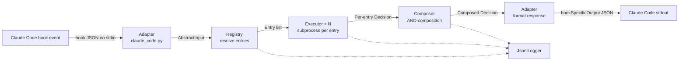

# Explanation: Architecture

A high-level tour of how dph is put together. For the full design
record, see [../swe/swe.2-software-architecture.md](../swe/swe.2-software-architecture.md).

## Layered structure

```
adapters/      vendor-specific glue (currently: claude_code.py)
core/          vendor-neutral engine (registry, executor, composer, logger)
dispatcher.py  entry point that wires adapter + core for one invocation
__main__.py    CLI surface: python -m dynamic_prompt_harness <trigger>
```

## Request flow



## Components

- **Adapter** — parses Claude Code's hook JSON into an `AbstractInput`
  (trigger, tool, tool_input, prompt, context); formats the final
  `Decision` back into the shape Claude Code expects.
- **Registry** — loads and validates `registry.json`; resolves which
  entries match a given trigger + tool.
- **Executor** — runs an entry's `command` as a subprocess with the
  `AbstractInput` on stdin; enforces `timeout_sec`; maps exit code and
  stdout to a `Decision`.
- **Composer** — reduces a list of per-entry `Decision`s to one composed
  `Decision` by AND semantics.
- **Logger** — appends a JSON record per decision to
  `.claude/dynamic-prompt-harness/logs/dph.log`.
- **Dispatcher** — wraps all of the above in a top-level try/except so
  that unexpected failures fall through to fail-safe ALLOW.

## Data contracts

- `AbstractInput` — see [../reference/subprocess-contract.md](../reference/subprocess-contract.md).
- `Decision` — `{decision, message, metadata}`.
- `Entry` — see [../reference/registry-schema.md](../reference/registry-schema.md).

All three are immutable frozen dataclasses in `core/io_contract.py`.

## Design intent

- **Single responsibility per module.** Executor does not know about
  composition; Composer does not know about subprocesses. This makes
  each unit testable in isolation (34 unit tests today).
- **Abstract input is the narrow waist.** Adding a second agent vendor
  means one new adapter; core and entries are unchanged.
- **JSON everywhere.** Registry, stdin, stdout, log — all JSON. Debug
  with `cat`, `jq`, and your text editor.

Deeper rationale, class diagrams, and sequence diagrams:
[../swe/swe.2-software-architecture.md](../swe/swe.2-software-architecture.md).
