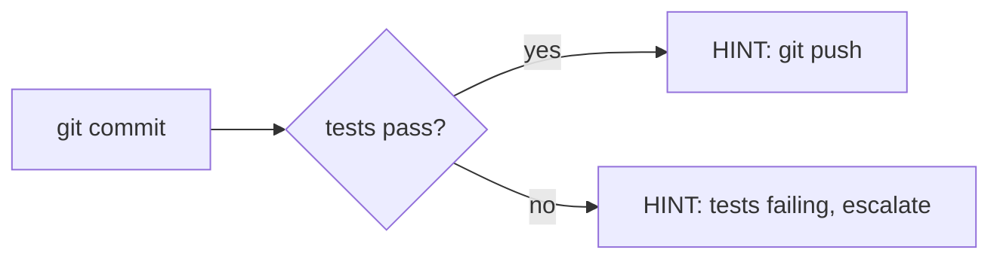
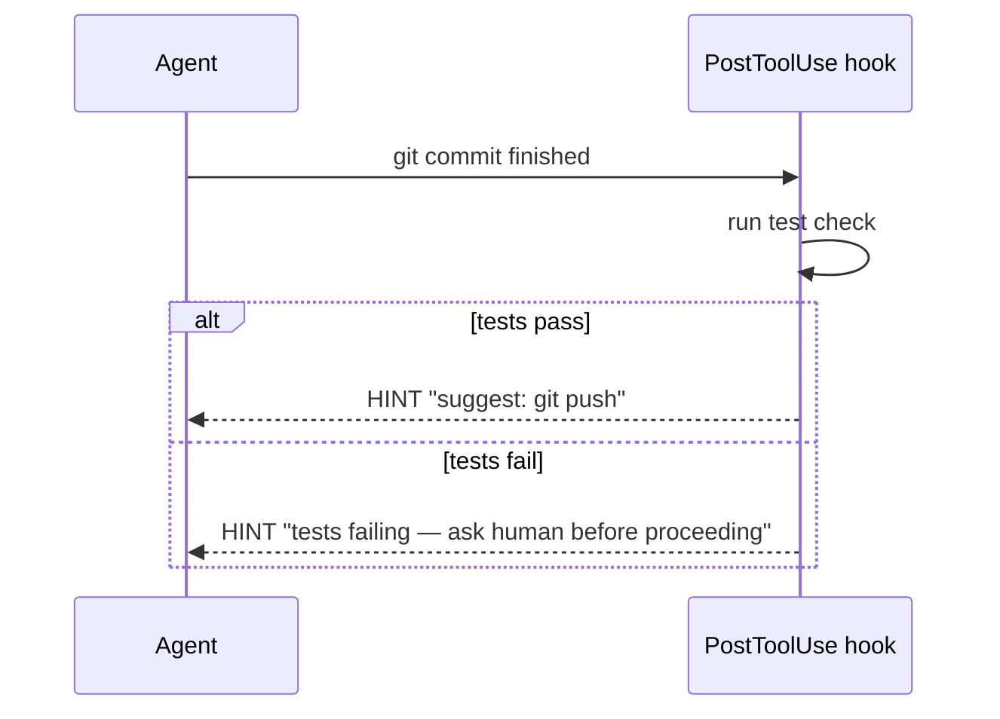

# Explanation: Dynamic Prompting

dph rests on three theses. The first says static prompts are not
enough. The second says dynamic prompts — if you can inject them at
event boundaries — are enough to express any workflow you want. The
third says dynamic prompting is a distinct stage in a broader
evolution, and dph deliberately stops at that stage's boundary.

## Thesis 1 — Necessity

Prompts are, by default, static. A system prompt and a long-lived
instruction file (such as an `AGENTS.md` or `CLAUDE.md`) are loaded
once and never change. All agent behavior must be encoded up front.

This hits structural limits:

- **Lost in the Middle** — as the context grows, instructions in the
  middle are attended to less reliably. Piling more rules into a
  static file makes the problem worse, not better.
- **Hallucination** — abstract or ambiguous instructions get
  plausibly reinterpreted by the model. "Don't commit secrets"
  does not specify what a secret looks like in this repo today.
- **Forgetting on long runs** — the longer a session lives, the
  more the model drifts from its opening rules. By turn 50 the
  opening constitution is a suggestion.

The fix is not to write the rules better. The fix is to deliver them
at the moment they are needed, into the live context, on the event
that makes them relevant. Prompts must be **injected on demand**.

The vehicles for on-demand injection are hooks and commands that fire
at event boundaries the agent crosses — before a tool call, after a
tool call, at prompt submission, before compaction. Output from those
hooks lands in the agent's context at exactly the moment it matters.

We call this pattern **dynamic prompting**.

| | Static prompt | Dynamic prompting |
|---|---|---|
| Timing | Once, at session start | On each relevant event |
| Volume | All rules always loaded | Just what this moment needs |
| Medium | System prompt, instruction file | Hook stdout, script output, SDK injection |
| Forgetting | Real on long runs | Recent by construction |
| Example | "Don't commit `.env`" in a rules file | On `git add` with `.env` in the path, DENY with reason |

## Thesis 2 — Sufficiency

A fair objection to Thesis 1: "fine, static is weak, but is dynamic
prompting actually rich enough to express real workflows?"

Claim: any workflow expressible as a UML activity diagram can be
realized via dynamic prompting. The activity diagram's primitives
each have a straightforward hook realization.

| Activity element | Hook realization |
|---|---|
| Action | PostToolUse detects step completion, emits the next-step HINT |
| Decision (branch) | Result inspected; different HINT or ALLOW/DENY per branch |
| Merge (join) | Hook detects that all required declarations are present, gates until then |
| Fork (parallel) | Independent declarations emitted concurrently, each observed by its own hook |
| Loop | PostToolUse → HINT → tool call → PostToolUse, with a break condition in the hook |
| Guard | PreToolUse checks a precondition, returns ALLOW or DENY |
| End | Hook detects the completion signal and notifies |

Read the table as: "for every shape you can draw in an activity
diagram, there is a hook pattern that realizes it." The mapping is
not approximate — each primitive has a direct counterpart.

### A small example

Activity fragment: "after a commit, run tests; if tests fail, stop
and ask the human; if they pass, suggest push."

Hook realization:

The Action is the commit event. The Decision is inside the hook. The
two branches each emit a different HINT. No branch was encoded in a
static prompt; all of it lives in code that runs at the right moment.

## Thesis 3 — Boundary

Theses 1 and 2 justify *why* dynamic prompting is needed and *how
much* it can express. Thesis 3 says *where dph stops*.

Prompt delivery has evolved through three stages. Each stage has a
different scope and different representative implementations:

| Stage | Scope | Representative |
|---|---|---|
| 1. Static prompting | Text loaded once at start | CLAUDE.md / system prompt |
| 2. Dynamic prompting | Runtime injection vehicles at event boundaries | Hook stdout, script output, dph |
| 3. Harness engineering | Brain / Hands / Session structural separation | Anthropic Managed Agents, Claude Code as a whole |

**dph lives at stage 2.** It is a registry-based dispatcher that
runs at event boundaries and composes the results of small scripts.
It does **not** rearchitect Brain, Hands, and Session — that is
stage-3 work. dph is designed to be plugged into a stage-3 harness
(today, Claude Code) and feed that harness's injection path.

Anthropic defines a harness precisely:

> the loop that calls Claude and routes Claude's tool calls to the
> relevant infrastructure

— Anthropic, *Managed Agents*[^managed-agents]

That loop — together with its Brain (the model), Hands (tools), and
Session (state and memory) — is stage-3 territory. dph does not
build that loop. It rides inside it.

The industry sometimes flattens stages 2 and 3 under a single
"harness patterns" label. The *12 Agentic Harness Patterns*
article[^12-patterns] is a useful taxonomy, but it spans both
stages: memory, workflow, tool wiring, and injection concerns appear
side by side. A broader pattern taxonomy exists; dph intentionally
scopes itself to stage 2.

Keeping the distinction matters for three practical reasons:

- **Debugging.** A stage-2 bug (a hook emits the wrong HINT) and a
  stage-3 bug (the harness loses tool-call routing) have different
  symptoms, different logs, and different fixes. Flattening the
  stages makes the debug path ambiguous.
- **Composition.** A stage-2 dispatcher can be swapped or extended
  without rewriting the harness. Conflating them forces every change
  to touch the orchestration loop.
- **Choosing the right tool.** Some problems demand session
  persistence or cross-turn memory; those belong in the harness. Some
  demand per-event decisions; those belong in dph. Naming the stages
  is what lets a team route a problem to the right layer.

dph is deliberately small. It does one thing — stage-2 dispatching
— and leaves stage-3 architecture to the harness it plugs into
(today Claude Code).

[^managed-agents]: https://www.anthropic.com/engineering/managed-agents
[^12-patterns]: https://generativeprogrammer.com/p/12-agentic-harness-patterns-from

## Why this matters for dph

dph is a dispatcher that runs small hook scripts ("harnesses") at
event boundaries and composes their decisions. The three theses
above are its reason to exist:

- Thesis 1 says you cannot get reliable behavior from static text alone.
- Thesis 2 says a hook-based system can express what you need.
- Thesis 3 says stage-2 dispatching deserves its own tool, separate
  from stage-3 harness engineering.

dph's contribution is the plumbing: a registry of entries, a
subprocess executor, a composer that aggregates decisions, and a
small set of reusable patterns on top.

The six stateless patterns that recur in practice — Gate, Guide,
Validator, Guard, Circuit Breaker, Monitor — are documented in
[../reference/harness-patterns.md](../reference/harness-patterns.md).
Each one corresponds to one or more rows in the Thesis 2 mapping.

## What to keep in static prompts

Dynamic prompting does not abolish the static prompt. It changes what
belongs there.

**Move to hooks:** event-driven rules, prohibitions, step-by-step
procedures — anything that must be enforced at a specific event.

**Keep in the static prompt:** project structure, directory
conventions, domain vocabulary, naming rules, pointers to where
things live. Material the model uses for judgment, not for compliance.

The static prompt becomes a map of the territory. The harness
enforces the rules of the road.
