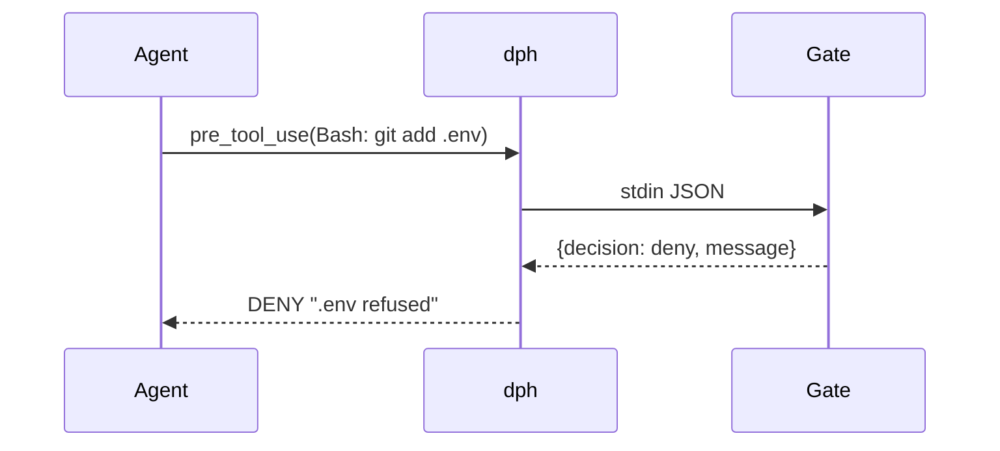
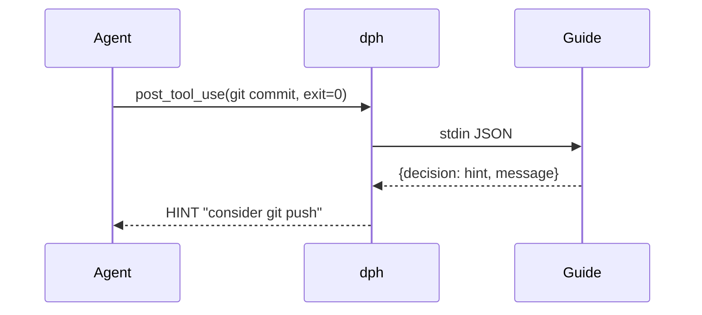
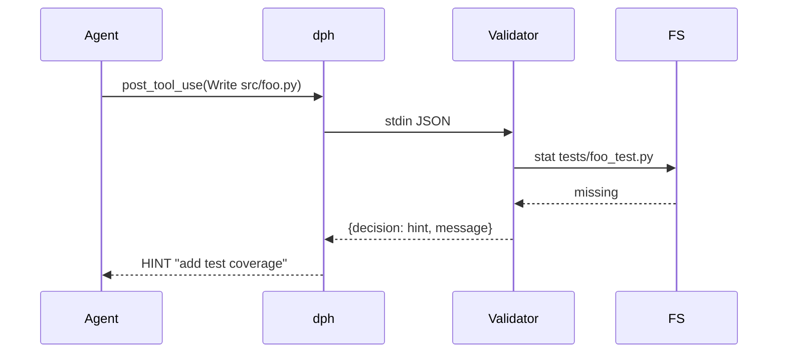
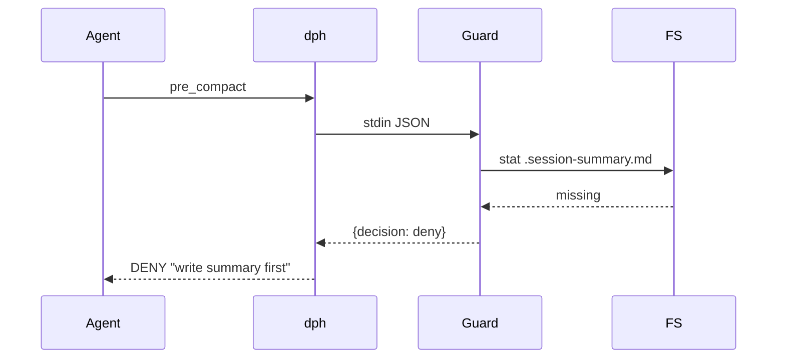
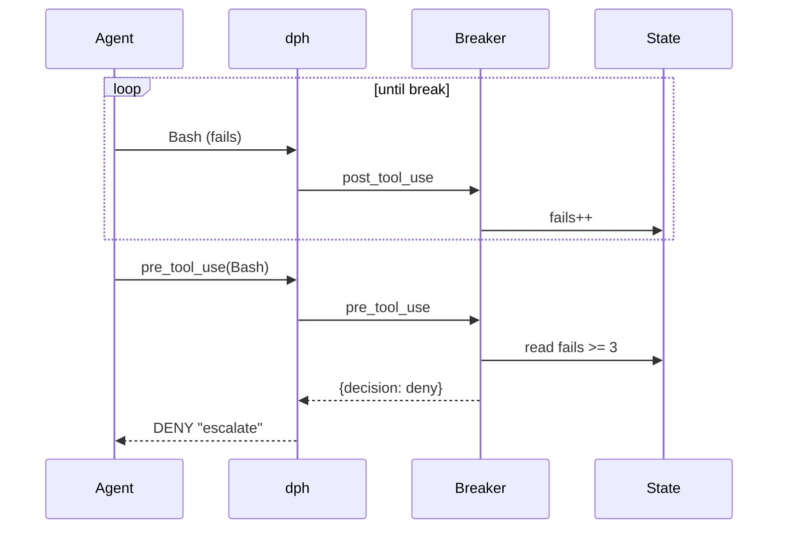
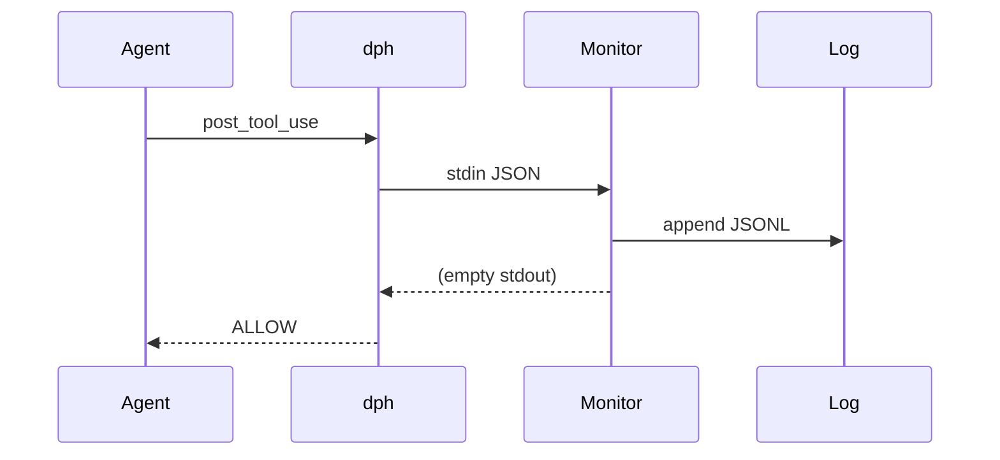

# Reference: Harness Patterns

Six stateless patterns cover the majority of real-world dph usage.
Each one is a recurring shape of harness: a trigger, a decision
function, and a stdout contract. Patterns compose — see the end of
this document.

All examples use the registry schema from
[registry-schema.md](registry-schema.md) and the subprocess contract
from [subprocess-contract.md](subprocess-contract.md).

Activity-diagram primitives map onto these patterns — see Thesis 2
in [../explanation/dynamic-prompting.md](../explanation/dynamic-prompting.md).

| Pattern | Activity element | Trigger | Emits |
|---|---|---|---|
| Gate | Guard | `pre_tool_use` | ALLOW or DENY |
| Guide | Action | `post_tool_use` | ALLOW or HINT |
| Validator | Decision | `post_tool_use` | ALLOW or HINT |
| Guard | Guard (precondition) | `pre_compact` / `pre_tool_use` | ALLOW or DENY |
| Circuit Breaker | Loop with break | `post_tool_use` + `pre_tool_use` | ALLOW or DENY |
| Monitor | — (observation) | any | ALLOW |

---

## 1. Gate

**Definition.** A pattern-match denial. The harness inspects tool
input against a rule; if it matches, the tool call is denied before
it runs.

**Activity element.** Guard.

**Trigger.** `pre_tool_use`.

**Decision shape.** ALLOW by default; DENY + message on match.

**Registry entry.**

```json
{
  "id": "block-env-in-git-add",
  "triggers": ["pre_tool_use"],
  "matcher": "^Bash$",
  "command": ["python", ".claude/dph/gate_env.py"],
  "priority": 100,
  "timeout_sec": 2.0
}
```

**Minimal harness (`gate_env.py`).**

```python
import json, re, sys

event = json.load(sys.stdin)
cmd = (event.get("tool_input") or {}).get("command", "")
if re.search(r"\bgit\s+add\b", cmd) and re.search(r"(^|\s)(\.env|secrets/)", cmd):
    json.dump({"decision": "deny",
               "message": "refuse to stage .env or secrets/ — add to .gitignore instead"},
              sys.stdout)
else:
    sys.stdout.write("")
```

**Sequence.**



---

## 2. Guide

**Definition.** A post-action next-step hint. After a tool call
succeeds, the harness suggests what to do next without forcing it.

**Activity element.** Action (edge to the next action).

**Trigger.** `post_tool_use`.

**Decision shape.** ALLOW or HINT + message. Never DENY.

**Registry entry.**

```json
{
  "id": "guide-push-after-commit",
  "triggers": ["post_tool_use"],
  "matcher": "^Bash$",
  "command": ["python", ".claude/dph/guide_push.py"]
}
```

**Minimal harness.**

```python
import json, re, sys

event = json.load(sys.stdin)
cmd = (event.get("tool_input") or {}).get("command", "")
result = event.get("tool_result") or {}
if re.search(r"\bgit\s+commit\b", cmd) and result.get("exit_code", 1) == 0:
    json.dump({"decision": "hint",
               "message": "commit landed — consider `git push` when ready"},
              sys.stdout)
```

**Sequence.**



---

## 3. Validator

**Definition.** Inspect an output or a resulting file-system state;
if a quality check fails, hint a correction. Unlike Gate, the action
already happened; unlike Guide, the hint is conditional on a check.

**Activity element.** Decision (branch).

**Trigger.** `post_tool_use`.

**Decision shape.** ALLOW if the check passes; HINT + message if not.

**Registry entry.**

```json
{
  "id": "validate-test-for-new-function",
  "triggers": ["post_tool_use"],
  "matcher": "^(Edit|Write)$",
  "command": ["python", ".claude/dph/validate_tests.py"]
}
```

**Minimal harness.**

```python
import json, os, sys

event = json.load(sys.stdin)
path = (event.get("tool_input") or {}).get("file_path", "")
if path.endswith(".py") and "/src/" in path.replace("\\", "/"):
    test_path = path.replace("/src/", "/tests/").replace(".py", "_test.py")
    if not os.path.exists(test_path):
        json.dump({"decision": "hint",
                   "message": f"no test file found at {test_path} — add coverage"},
                  sys.stdout)
```

**Sequence.**



---

## 4. Guard

**Definition.** A precondition check on a non-tool event (for
example, `pre_compact`). If a required artifact or state is missing,
deny the event.

**Activity element.** Guard.

**Trigger.** `pre_compact` (or `pre_tool_use` for tool preconditions).

**Decision shape.** ALLOW if the precondition holds; DENY + message
otherwise.

**Registry entry.**

```json
{
  "id": "guard-compact-requires-summary",
  "triggers": ["pre_compact"],
  "command": ["python", ".claude/dph/guard_summary.py"],
  "timeout_sec": 3.0
}
```

**Minimal harness.**

```python
import json, os, sys

event = json.load(sys.stdin)
cwd = (event.get("context") or {}).get("cwd", ".")
if not os.path.exists(os.path.join(cwd, ".session-summary.md")):
    json.dump({"decision": "deny",
               "message": "write .session-summary.md before compacting"},
              sys.stdout)
```

**Sequence.**



---

## 5. Circuit Breaker

**Definition.** After N consecutive failures of the same tool,
deny further invocations of that tool and hint human escalation.

**Activity element.** Loop with a break condition.

**Trigger.** `post_tool_use` (to count failures) and `pre_tool_use`
(to gate when the threshold is crossed).

**Decision shape.** ALLOW normally; DENY + message when the breaker
is open.

> **Boundary.** dph core is stateless — the registry and composer do
> not persist counters. A Circuit Breaker therefore owns its state
> file. The example below writes a JSON counter to disk. Use a path
> under `.claude/dph/state/` so that it is easy to reset.

**Registry entry.**

```json
{
  "id": "breaker-bash",
  "triggers": ["pre_tool_use", "post_tool_use"],
  "matcher": "^Bash$",
  "command": ["python", ".claude/dph/breaker.py"],
  "priority": 50
}
```

**Minimal harness.**

```python
import json, os, sys

STATE = ".claude/dph/state/breaker-bash.json"
THRESHOLD = 3

os.makedirs(os.path.dirname(STATE), exist_ok=True)
state = json.load(open(STATE)) if os.path.exists(STATE) else {"fails": 0}
event = json.load(sys.stdin)
trig = event["trigger"]

if trig == "post_tool_use":
    rc = (event.get("tool_result") or {}).get("exit_code", 0)
    state["fails"] = state["fails"] + 1 if rc != 0 else 0
    json.dump(state, open(STATE, "w"))
elif trig == "pre_tool_use" and state["fails"] >= THRESHOLD:
    json.dump({"decision": "deny",
               "message": f"Bash failed {state['fails']}x — escalate to human"},
              sys.stdout)
```

**Sequence.**



---

## 6. Monitor

**Definition.** Observation-only. Emits a log record and returns
ALLOW. Zero effect on agent flow.

**Activity element.** Not an activity-graph node — orthogonal to the
workflow, like an APM probe.

**Trigger.** Any.

**Decision shape.** Always ALLOW (empty stdout).

**Registry entry.**

```json
{
  "id": "monitor-tool-calls",
  "triggers": ["post_tool_use"],
  "command": ["python", ".claude/dph/monitor.py"]
}
```

**Minimal harness.**

```python
import json, sys, time, os

event = json.load(sys.stdin)
os.makedirs(".claude/dph/logs", exist_ok=True)
with open(".claude/dph/logs/tool_calls.jsonl", "a", encoding="utf-8") as f:
    f.write(json.dumps({
        "ts": time.time(),
        "tool": event.get("tool"),
        "trigger": event["trigger"],
    }) + "\n")
# empty stdout → ALLOW
```

**Sequence.**



---

## Composition

Patterns coexist by AND-composition on each event:

- **Any DENY wins.** One blocker is enough to stop the event.
- **HINTs concatenate.** Multiple advisors stack their messages.
- **ALLOW is the default.** If no harness denies or hints, the event
  proceeds unchanged.

A realistic registry mixes several patterns on the same trigger: a
Gate for hard prohibitions, a few Validators for quality checks, a
Guide for next-step suggestions, and a Monitor for observability.
They do not need to know about each other — the composer does that
work.

See [registry-schema.md](registry-schema.md) for how entries are
listed and ordered, and
[subprocess-contract.md](subprocess-contract.md) for the exact I/O
rules every harness must follow.
