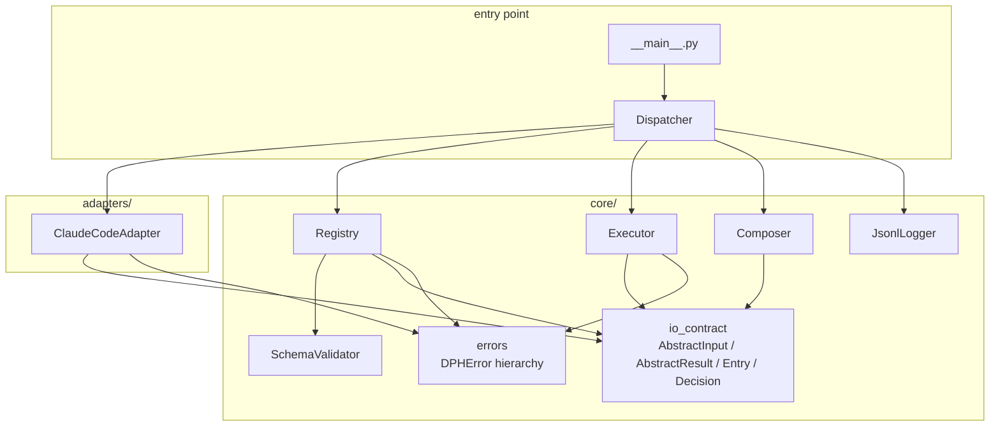
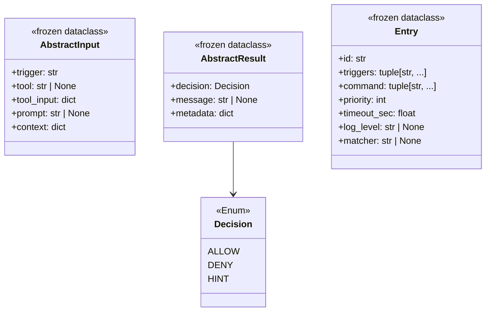
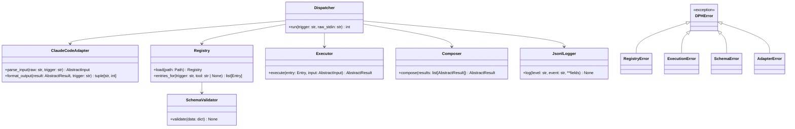
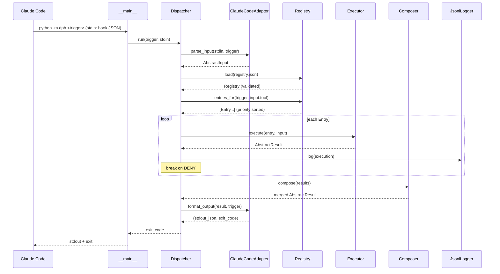
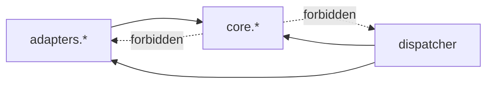
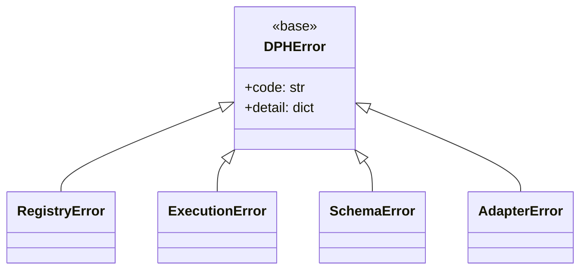

# SWE.2 Software Architectural Design — dynamic-prompt-harness

**Scope**: Agreement on class structure, responsibility boundaries, dependency direction, and interface overview.
Internal implementation (algorithms, private methods, detailed error branching) is finalized in SWE.3 / during implementation.

**Decisions (agreed in brainstorming)**:
- Executor uses **subprocess style** (arbitrary command execution; bash/node/python can coexist)
- Registry entries use a **fixed schema + `frozen dataclass` + JSON Schema double defense**
- Exception handling uses a **core-defined `DPHError` hierarchy**, caught at the top of the dispatcher
- Adapters are **one pair per vendor** (`parse_input` / `format_output`)
- Registry is **loaded per invocation, filtered only by trigger type**

---

## 1. Module layout and class inventory



| Module | Class / Type | Role |
|---|---|---|
| `core.io_contract` | `AbstractInput`, `AbstractResult`, `Entry`, `Decision` (Enum) | Frozen dataclass / Enum shared across all layers |
| `core.registry` | `Registry` | Loads `registry.json`, applies trigger filter, priority sort |
| `core.executor` | `Executor` | Runs `Entry` as subprocess; converts stdout/exit into `AbstractResult` |
| `core.composer` | `Composer` | Folds multiple `AbstractResult` via AND-composition |
| `core.schema` | `SchemaValidator` | Validates registry.json using stdlib only |
| `core.logger` | `JsonlLogger` | Appends JSONL; manages log_level granularity |
| `core.errors` | `DPHError`, `RegistryError`, `ExecutionError`, `SchemaError`, `AdapterError` | Exception hierarchy |
| `adapters.claude_code` | `ClaudeCodeAdapter` | Converts between Claude Code hook JSON and `Abstract*` |
| `dispatcher` | `Dispatcher` | Overall flow control; top-level exception handler |

---

## 2. Data structures (core.io_contract)



**Invariants**:
- `Entry.triggers` is a tuple of values drawn from `pre_tool_use` / `post_tool_use` / `user_prompt_submit` / `pre_compact` (no duplicates)
- `Entry.command` is a tuple (not a list) — guaranteed by frozen
- `AbstractInput.trigger` has the same value domain as Entry.triggers
- When `AbstractResult.decision == DENY`, `message` is required (so the composer can build a merged message)

---

## 3. Class relationship diagram (key interfaces)



---

## 4. Execution sequence



**Short-circuit condition**: as soon as any Entry returns `DENY`, subsequent Entries are not executed (FR-033).
**Empty registry**: when `entries_for` returns an empty list, Composer returns `AbstractResult(ALLOW, None, {})` (FR-071).

---

## 5. Dependency direction (Dependency Rules)



- **AP-2 restated**: core must not import adapters. This guarantees that adding a new vendor requires no changes to core.
- dispatcher is the top-level glue layer that may know about both.
- Within `core.*`, mutual dependencies flow only one way: `io_contract` / `errors` → everything else (`io_contract` is a leaf imported by other modules).

---

## 6. Exception hierarchy and responsibilities



| Exception | Origin | Dispatcher handling |
|---|---|---|
| `SchemaError` | `SchemaValidator.validate` | log(error) → exit with ALLOW (do not break installation; FR-071 family) |
| `RegistryError` | `Registry.load` (IO / JSON parse) | Same as above |
| `ExecutionError` | `Executor.execute` (subprocess timeout / non-zero exit) | log(error) → skip this entry and continue |
| `AdapterError` | `parse_input` / `format_output` | log(error) → exit 0 / empty stdout (do not interfere with hook behavior) |
| Unknown exception | Anywhere | log(critical) → exit 0 fail-safe |

**Fail-safe principle**: bugs in the dispatcher itself must never stop Claude Code. DENY occurs only by explicit registry intent.

---

## 7. Interface summary (signatures only)

```python
# adapters/claude_code.py
class ClaudeCodeAdapter:
    def parse_input(self, raw: str, trigger: str) -> AbstractInput: ...
    def format_output(self, result: AbstractResult, trigger: str) -> tuple[str, int]: ...

# core/registry.py
class Registry:
    @classmethod
    def load(cls, path: Path) -> "Registry": ...
    def entries_for(self, trigger: str, tool: str | None) -> list[Entry]: ...

# core/executor.py
class Executor:
    def __init__(self, cwd: Path, logger: JsonlLogger) -> None: ...
    def execute(self, entry: Entry, input: AbstractInput) -> AbstractResult: ...

# core/composer.py
class Composer:
    def compose(self, results: list[AbstractResult]) -> AbstractResult: ...

# core/schema.py
class SchemaValidator:
    def validate(self, data: dict) -> None: ...  # raises SchemaError

# core/logger.py
class JsonlLogger:
    def __init__(self, path: Path, level: str) -> None: ...
    def log(self, level: str, event: str, **fields) -> None: ...

# dispatcher.py
class Dispatcher:
    def run(self, trigger: str, raw_stdin: str) -> int: ...
```

Internal private methods / algorithms / branching details are finalized in SWE.3 / during implementation (out of scope for this document).

---

## 8. Testability (SWE.2 perspective)

- **Unit isolation**: each class injects its dependencies via `__init__`; side effects (file IO, subprocess) are localized to `Executor` / `JsonlLogger` / `Registry.load`
- **Mock boundary**: swapping `Executor.execute` and `JsonlLogger.log` lets the dispatcher run end-to-end in memory
- **Contract test**: `ClaudeCodeAdapter` can be round-trip tested against real hook JSON samples (`.claude/settings.json` / official documentation)
- **Schema test**: `SchemaValidator` is covered by positive / negative fixtures

---

## 9. Traceability (SYS.3 → SWE.2)

| SYS.3 element | SWE.2 class |
|---|---|
| §4 adapters/claude_code | `ClaudeCodeAdapter` |
| §4 core.registry | `Registry` + `SchemaValidator` |
| §4 core.executor | `Executor` |
| §4 core.composer | `Composer` |
| §4 core.io_contract | `io_contract` dataclasses |
| §4 core.logger | `JsonlLogger` |
| §4 dispatcher | `Dispatcher` |
| §6 AP-2 (core→adapters forbidden) | §5 Dependency direction |
| §7 8-step processing sequence | §4 Execution sequence |
| §8 empty registry ALLOW | §4 note + §6 fail-safe |

---

## 10. Next steps

- [ ] Review this document
- [ ] SWE.3 Detailed Design (internal algorithms, private methods) — can proceed in parallel with implementation
- [ ] TDD: work red→green in the order `io_contract` → `SchemaValidator` → `Registry` → `Composer` → `Executor` → `ClaudeCodeAdapter` → `Dispatcher`
