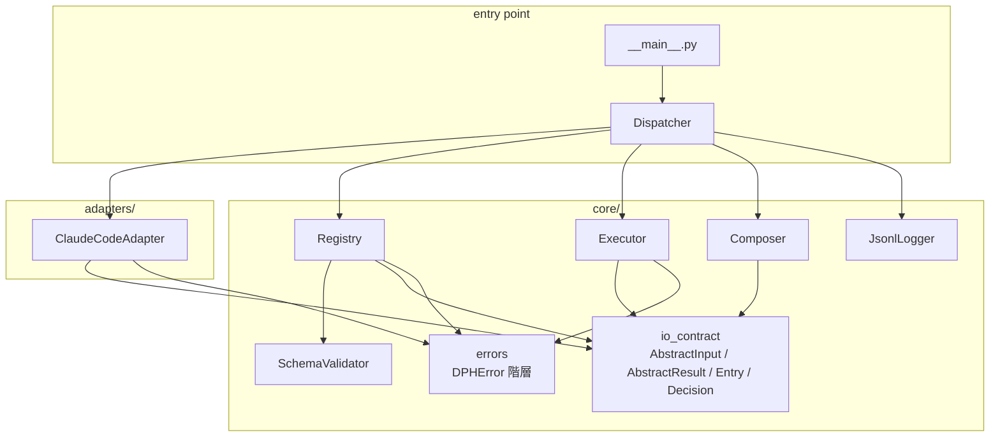
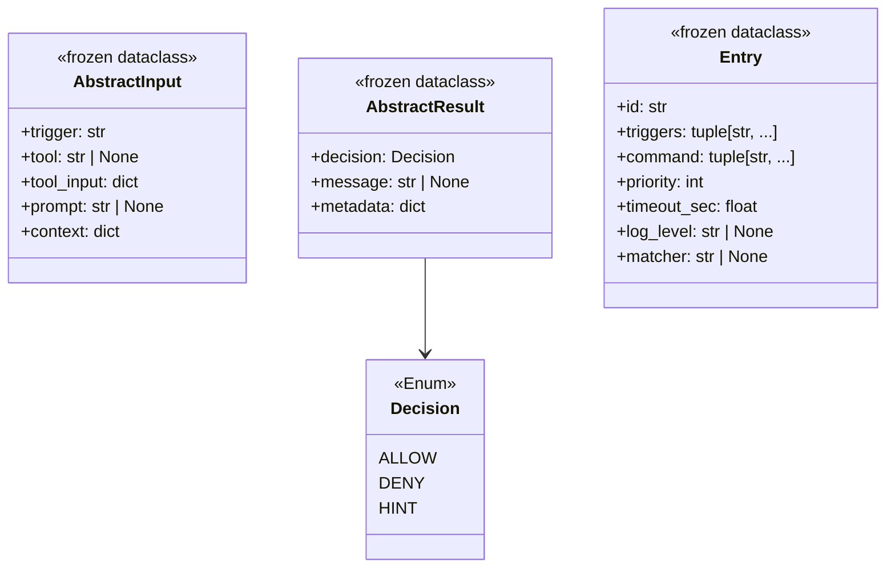
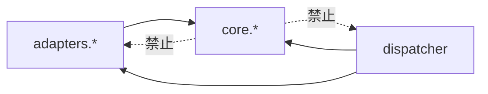
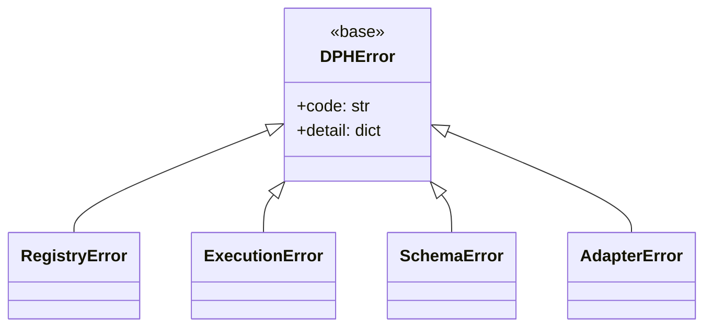

# SWE.2 Software Architectural Design — dynamic-prompt-harness

**Scope**: クラス構造・責務境界・依存方向・インターフェース概要の合意。
内部実装（アルゴリズム・private メソッド・エラー分岐の詳細）は SWE.3 / 実装時に確定する。

**決定事項（brainstorming で合意済み）**：
- Executor は **subprocess 方式**（任意コマンド実行、bash/node/python 混在可）
- Registry entry は **固定スキーマ + `frozen dataclass` + JSON Schema 二重防御**
- 例外処理は **コア定義の `DPHError` 階層**、dispatcher トップで catch
- Adapter は **vendor ごとに 1 ペア**（`parse_input` / `format_output`）
- Registry は **invocation ごと読込、trigger 種別だけフィルタ**

---

## 1. モジュール構成とクラス一覧



| モジュール | クラス / 型 | 役割 |
|---|---|---|
| `core.io_contract` | `AbstractInput`, `AbstractResult`, `Entry`, `Decision` (Enum) | 全層共有の frozen dataclass / Enum |
| `core.registry` | `Registry` | `registry.json` ロード・trigger filter・priority sort |
| `core.executor` | `Executor` | `Entry` を subprocess 実行、stdout/exit を `AbstractResult` に変換 |
| `core.composer` | `Composer` | 複数 `AbstractResult` を AND-composition で畳む |
| `core.schema` | `SchemaValidator` | registry.json を stdlib のみで検証 |
| `core.logger` | `JsonlLogger` | JSONL 追記、log_level 精度管理 |
| `core.errors` | `DPHError`, `RegistryError`, `ExecutionError`, `SchemaError`, `AdapterError` | 例外階層 |
| `adapters.claude_code` | `ClaudeCodeAdapter` | Claude Code hook JSON ↔ `Abstract*` 変換 |
| `dispatcher` | `Dispatcher` | 全体フロー制御、トップレベル例外ハンドラ |

---

## 2. データ構造（core.io_contract）



**不変条件**:
- `Entry.triggers` は `pre_tool_use` / `post_tool_use` / `user_prompt_submit` / `pre_compact` のいずれかの tuple（重複不可）
- `Entry.command` は tuple（list ではない）— frozen 保証
- `AbstractInput.trigger` は Entry.triggers と同値域
- `AbstractResult.decision == DENY` のとき `message` は必須（composer が統合メッセージを作るため）

---

## 3. クラス関係図（主要インターフェース）


---

## 4. 実行シーケンス


**短絡条件**: いずれかの Entry が `DENY` を返した時点で以降の Entry を実行しない（FR-033）。
**空レジストリ**: `entries_for` が空 list を返した場合、Composer は `AbstractResult(ALLOW, None, {})` を返す（FR-071）。

---

## 5. 依存方向（Dependency Rules）



- **AP-2 再掲**: core は adapters を import してはならない。vendor 追加時に core 改変不要を保証
- dispatcher は両方を知ってよいトップレベル接着層
- `core.*` 内の相互依存は `io_contract` / `errors` → その他の一方向のみ（`io_contract` は葉、他モジュールが import する）

---

## 6. 例外階層と責務



| 例外 | 発生源 | dispatcher の扱い |
|---|---|---|
| `SchemaError` | `SchemaValidator.validate` | log(error) → ALLOW で抜ける（install 壊さない、FR-071 系） |
| `RegistryError` | `Registry.load` (IO/JSON parse) | 同上 |
| `ExecutionError` | `Executor.execute` (subprocess timeout/非0) | log(error) → この entry をスキップして次へ |
| `AdapterError` | `parse_input` / `format_output` | log(error) → exit 0 / stdout 空（hook 動作に干渉しない） |
| 未知の例外 | 任意 | log(critical) → exit 0 fail-safe |

**fail-safe 原則**: dispatcher 自体のバグは Claude Code の動作を止めない。DENY は registry の意図によってのみ発生する。

---

## 7. インターフェース要約（シグネチャのみ）

```python
# adapters/claude_code.py
class ClaudeCodeAdapter:
    def parse_input(self, raw: str, trigger: str) -> AbstractInput: ...
    def format_output(self, result: AbstractResult, trigger: str) -> tuple[str, int]: ...

# core/registry.py
class Registry:
    @classmethod
    def load(cls, path: Path) -> "Registry": ...
    def entries_for(self, trigger: str, tool: str | None) -> list[Entry]: ...

# core/executor.py
class Executor:
    def __init__(self, cwd: Path, logger: JsonlLogger) -> None: ...
    def execute(self, entry: Entry, input: AbstractInput) -> AbstractResult: ...

# core/composer.py
class Composer:
    def compose(self, results: list[AbstractResult]) -> AbstractResult: ...

# core/schema.py
class SchemaValidator:
    def validate(self, data: dict) -> None: ...  # raises SchemaError

# core/logger.py
class JsonlLogger:
    def __init__(self, path: Path, level: str) -> None: ...
    def log(self, level: str, event: str, **fields) -> None: ...

# dispatcher.py
class Dispatcher:
    def run(self, trigger: str, raw_stdin: str) -> int: ...
```

内部 private メソッド / アルゴリズム / 分岐詳細は SWE.3 / 実装時に確定（本書のスコープ外）。

---

## 8. テスト可能性（SWE.2 観点）

- **単体性**: 各クラスは `__init__` で依存を注入、副作用（ファイル IO・subprocess）は `Executor` / `JsonlLogger` / `Registry.load` に局所化
- **Mock 境界**: `Executor.execute` と `JsonlLogger.log` を差し替えれば dispatcher はインメモリで完結
- **Contract test**: `ClaudeCodeAdapter` は実 hook JSON サンプル（`.claude/settings.json` / 公式ドキュメント）に対して往復テスト可能
- **Schema test**: `SchemaValidator` は正例 / 負例 fixture で網羅

---

## 9. トレーサビリティ（SYS.3 → SWE.2）

| SYS.3 要素 | SWE.2 クラス |
|---|---|
| §4 adapters/claude_code | `ClaudeCodeAdapter` |
| §4 core.registry | `Registry` + `SchemaValidator` |
| §4 core.executor | `Executor` |
| §4 core.composer | `Composer` |
| §4 core.io_contract | `io_contract` dataclass 群 |
| §4 core.logger | `JsonlLogger` |
| §4 dispatcher | `Dispatcher` |
| §6 AP-2（core→adapters 禁止） | §5 依存方向 |
| §7 処理シーケンス 8 ステップ | §4 実行シーケンス |
| §8 empty registry ALLOW | §4 注記 + §6 fail-safe |

---

## 10. 次ステップ

- [ ] 本書レビュー
- [ ] SWE.3 Detailed Design（内部アルゴリズム・private メソッド）— 実装と同時進行可
- [ ] TDD: `io_contract` → `SchemaValidator` → `Registry` → `Composer` → `Executor` → `ClaudeCodeAdapter` → `Dispatcher` の順で red→green
